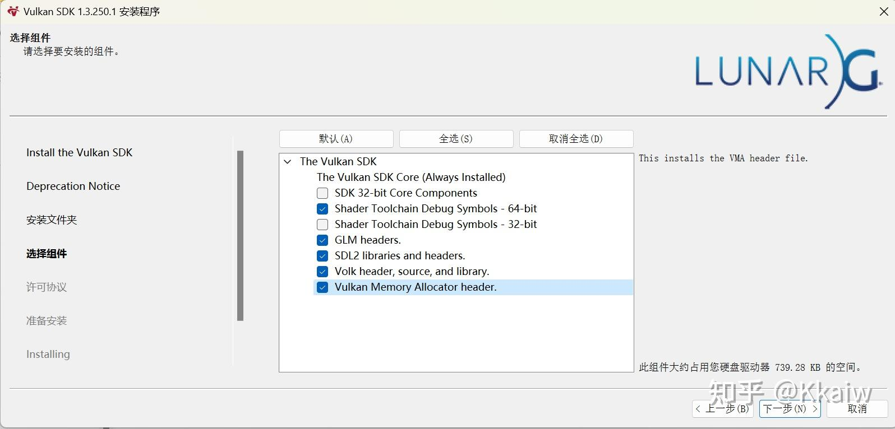
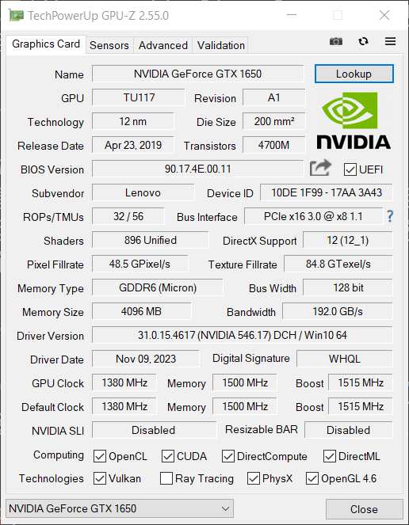

# Vulkan环境搭建

## 1. 安装Vulkan SDK

在[这里](https://vulkan.lunarg.com/)根据自己操作系统安装。安装时选择组件参考：

## 2. 验证

安装成功后需要验证Vulkan是否安装成功，并且硬件是否支持Vulkan。打开Vulkan的安装目录，运行`Bin/vkcube.exe`，如果能够成功运行则环境搭建完毕

## 3. 检测硬件是否支持Vulkan

安装[GPU-Z](https://www.techpowerup.com/gpuz/)，打开后如果Vulkan栏已被勾上，说明硬件支持Vulkan

Vulkan栏未被勾上可能是因为硬件支持，但是**显卡驱动版本太低**，不仅是独显驱动，如果核显驱动太低也不行

## 4. 显卡驱动升级

### N卡

下载安装[GeForce Experience](https://www.nvidia.cn/geforce/drivers/)，会自动帮你检测并升级与Nvidia硬件匹配的驱动

### A卡

!!! tip "核显是AMD的也用此方法升级"

下载安装[AMD Software: Adrenalin Edition](https://www.amd.com/en/support)，会自动帮你检测并升级与Nvidia硬件匹配的驱动。也可以根据自己的显卡型号下载对应版本的软件，比如[Ryzen5 4600H](https://www.amd.com/en/support/apu/amd-ryzen-processors/amd-ryzen-5-mobile-processors-radeon-graphics/amd-ryzen-5-4600h)

- 在升级驱动的过程中，可能会导致操作系统阻止核显驱动的升级，解决方法可以参考[Error 205 - AMD Software Installation Completed Successfully but Windows Update May Have Reverted Your Driver Version During the Process](https://www.amd.com/en/support/kb/faq/gpu-kb205)

- 也可能出现AMD Software版本与当前安装的AMD显卡驱动程序不兼容，解决方法参考[AMD Software Compatibility Tool](https://www.amd.com/en/support/kb/faq/pa-300)
