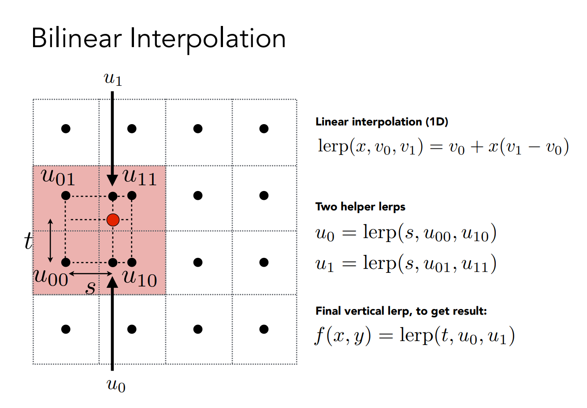
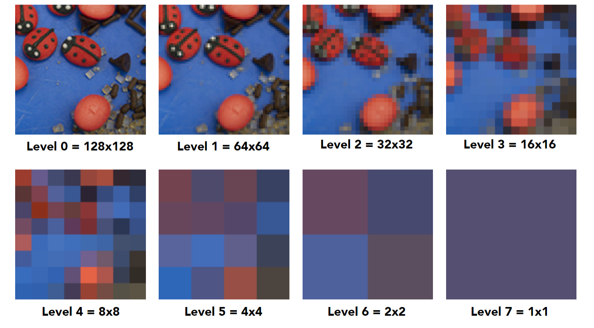

# Textures

!!! example "未完结"

## Applying Textures

~~~c++
// (x, y) usually a pixel's center
for each rasterized screen sample (x,y):
	// using barycentric coordinates
	(u, v) = evaluate texture coordinate at (x,y)
	texcolor = texture.sample(u, v);
	// usually the diffuse albedo Kd (recall the Blinn-Phong reflectance model)
	set sample color to texcolor;
~~~

所以`texture.sample(u, v)`具体如何实现呢？
最简单的方式：找到uv对应离的最近的texel直接返回像素值

~~~c++
color texture::sample(float u, float v)
{
	int x = std::round(u * texture_width); // 四舍五入
	int y = std::round(v * texture_height);
	return texture_image[x, y];
}
~~~
但是当纹理分辨率过大或者过小；又或者物体离相机很近或者很小，导致一个像素相比一个纹理像素很小或很大（本质上就是像素和纹理像素的大小对应不平衡）的时候，会出现问题。

## Texture Magnification

### Texture is too Small

当一个低分辨率的纹理图像需要拉伸到高分辨率的像素上时，在查询纹理有以下几种策略：

#### Nearest

- 选择uv最近的一个像素中心并返回（即对uv进行四舍五入）
- 缺点：有锯齿状，不平滑

#### Bilinear

- 选择离uv最近的四个像素中心进行双线性插值

#### Bicubic

- 选择离uv最近的16个像素进行三线性插值

### Texture is too Large

!!! danger "严重走样问题： 远处摩尔纹Moire，近处锯齿Jaggies"
	图中底层灰色框表示一个个的纹理像素texel，灰点表示纹理像素的中心
	
	上层斜着的黑色框表示屏幕像素，蓝点表示屏幕像素的中心

!!! tip "问题原因：屏幕上的像素覆盖纹理的大小是各不相同的"

近处一个像素覆盖较**少**的纹理，因此使用该像素对应插值得到的uv查询对应的纹理值，近似为像素值（没有问题）

远处一个像素覆盖较**大**的纹理，只用离uv最近的纹理像素代表覆盖的所有像素的平均值，显然是有问题的！

!!! tip "问题本质：信号速度变化过快，采样频率更不上"
	一个像素内包含了很多纹理像素，一个像素内的纹理变化频率很高，却只用一个采样点去采样导致了走样

#### Solution1: MSAA

对于一个像素不止取像素中心的uv，比如可以在一个像素范围内随机取512个uv，然后所有uv分别进行sample最后取平均

- 优点：准确！比以下各种方法都要准确（力大砖飞）
- 缺点：算法特别慢

#### Solution2: MipMap

如果给定任何一个区域，可以快速得到区域的平均值就好了

!!! note "Point Query vs. (Avg.) Range Query"
	- 点查询，比如给你一个点他的值是多少（如双线性插值）
	- 范围查询，给你一个区域，立刻得到区域的平均值（还比如区域的最大值最小值）

**MipMap**：允许做范围查询

- Fast
- Approx（近似值）
- Square（只能查正方形）

## MipMap

!!! tip "MipMap就是使用一张图生成一系列图"

假设原始纹理宽为$n$，总共会有$log_2n$层。MipMap一般就是提前计算（渲染之前），因此会得到一个图像金字塔

!!! question "MipMap产生导致的额外存储量？"
	原本图是$1$，总量是$\frac{4}{3}$，增加了$\frac{1}{3}$

### MipMap查询过程

## Applications of Textures

在现代GPU中，texture = memory + range query (filtering)，可以理解为有一块区域我可以做查询（或者滤波），包括点查询和范围查询。不仅仅是图像！

### Environment Lighting

Environment Map（环境光照，环境光映射，环境贴图）：一个房间里，四面八方都会有光（不管是直接光照还是间接光照），如果我们把任何方向的光都记录下来，这就是环境贴图

!!! tip "用纹理描述整个环境光，用环境光去渲染其他的物体（效果肯定比点光源好）"

!!! quote
	这个著名的茶壶为Utah teapot，其他还有Stanford Bunny，Stanford Dragon，Cornell Box（验证全局光照）

用纹理描述环境光，有一个假设是环境光都来自**无限远出**，因此只记录了光的**方向信息**（没有位置信息）

#### Spherical Environment Map

把环境光记录在球上，并且可以展开
