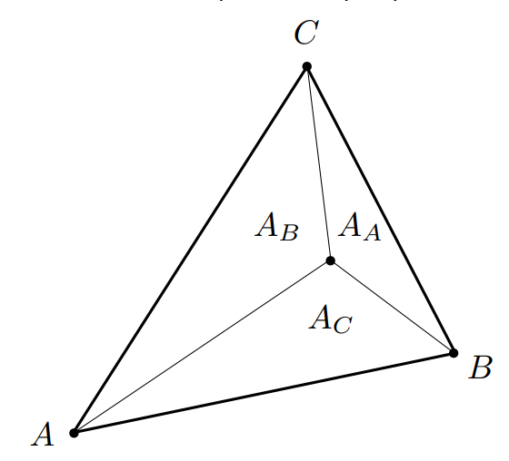

# 重心坐标

## Definition

**重心坐标（Barycentric Coordinates ）**，对于2D平面中的任意一个三角形，顶点分别为$A(x_a, y_a)$，$B(x_b, y_b)$ ，$C(x_c,y_c)$，平面上任意一点$(x, y)$都可以表示为：

$$
(x,y) = \alpha A + \beta B + \gamma C
$$

或者：

$$
\binom{x}{y} = \alpha \binom{x_a}{y_a} + \beta \binom{x_b}{y_b} + \gamma \binom{x_c}{y_c}
$$

其中：

$$
\alpha + \beta + \gamma = 1
$$

并且，当这个点在三角形内部时，$\alpha, \beta, \gamma$ 都位于$(0, 1)$之间

## Solve Alpha, Beta, Gamma

$$
\alpha = \frac{A_A}{A_A + A_B + A_C}
$$

$$
\beta = \frac{A_B}{A_A + A_B + A_C}
$$

$$
\gamma = \frac{A_C}{A_A + A_B + A_C} = 1 - \alpha - \beta
$$

当$\alpha=\beta=\gamma = \frac{1}{3}$时，$A_A = A_B = A_C$，该点也是这个三角形的**重心**

### 重心坐标的应用

在光栅化后对屏幕上每个像素进行着色时（即Fragment Shading），我们已知一个三角形三个顶点的各种属性数据（纹理坐标，颜色，法线向量，深度z，各种material attributes等），使用重心坐标插值处每个像素对应的各种顶点属性数据。

$$
V = \alpha V_A + \beta V_B + \gamma V_C
$$

!!! tip "重心坐标在投影变换后不一致!"

即空间中一个三角形ABC和三角形内部一个点P，投影到平面对应点为A'B'C'和内部点P'，P的$\alpha \beta \gamma$和P'不相同！因此在插值深度z时需要进行深度修正

!!! todo "深度修正公式"
