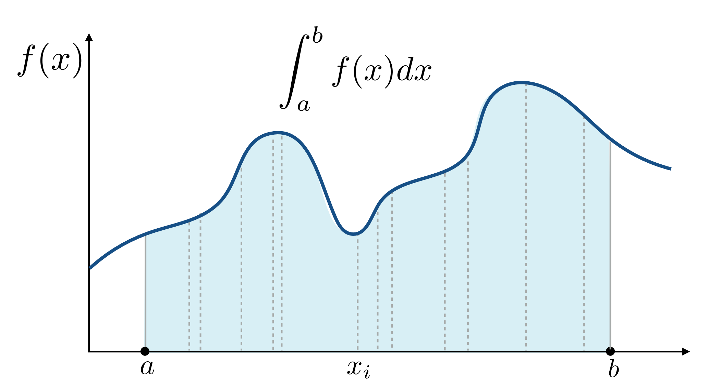

**PDF**：Probability Distribution Function（概率密度函数）

## Monte Carlo Integration

求解定积分的数值方法

在积分域（$a\sim b$）随机采样（根据一个PDF去采样）一个$x$，得到对应的$f(x)$，将$f(x)\cdot (b - a)$这个矩形面积近似成定积分的值。重复多次采样x，将所有的矩形面积求平均就可以近似定积分的值。

定义一个积分：

$$
\int_a^bf(x)dx
$$

随机变量服从某个分布：

$$
X_i \sim p(x)
$$

Monte Carlo estimator：
这个积分域已经在PDF函数中体现出来了

$$
\int f(x)dx = F_N = \frac{1}{N}\sum_{i=1}^N\frac{f(X_i)}{p(X_i)}
~~~X_i \sim p(x)
$$

- 采样越多，结果越精确
- 要在x上积分，就要采样x

### Uniform Monte Carlo Estimator

假设概率密度函数为常数

$$X_i \sim p(x) = C$$

$$
\begin{aligned}
&\int_a^bp(x)dx=1 \\
\Rightarrow~~&\int_a^bCdx=1 \\
\Rightarrow~~&C = \frac{1}{b - a}
\end{aligned}
$$

因此

$$
X_i \sim p(x) = \frac{1}{b - a}
$$

$$
F_N = \frac{b - a}{N}\sum_{i=1}^Nf(X_i)
$$

## Motivation：Whitted-Style Ray Tracing

- Always perform specular reflections / refractions
- Stop bouncing at diffuse surfaces

问题一：只能模拟Mirror Reflection，不能模拟 Glossy Reflection。因为Glossy的反射光是镜面反射+一点点小的偏角造成的。

问题二：当打到Diffuse物体上时光线直接停止。因为Diffuse物体上仍然会反射（只是均匀反射到其他方向上去）

Color Bleeding：漫反射物体上的颜色跑到了其他物体上（就是由于漫反射物体也会反射光造成的）

## Path Tracing

path：视点到光源的一条路径

## Ray Tracing Concepts

Previous：Ray tracing == Whitted-style ray tracing

Modern：**The general solution of light transport**, including

- (Unidirectional & bidirectional) path tracing
- Photon mapping
- Metropolis light transport
- VCM / UPBP ...