## Barycentric Coordinates 重心坐标

对于2D平面中的任意一个三角形，顶点分别为$A(x_a, y_a)$，$B(x_b, y_b)$ ，$C(x_c,y_c)$，平面上任意一点$(x, y)$都可以表示为：

$$
(x,y) = \alpha A + \beta B + \gamma C
$$

或者：

$$
\binom{x}{y} = \alpha \binom{x_a}{y_a} + \beta \binom{x_b}{y_b} + \gamma \binom{x_c}{y_c}
$$

其中：

$$
\alpha + \beta + \gamma = 1
$$

并且，当这个点在三角形内部时，$\alpha, \beta, \gamma$ 都位于$(0, 1)$之间。

### Solve $\alpha, \beta, \gamma$ 

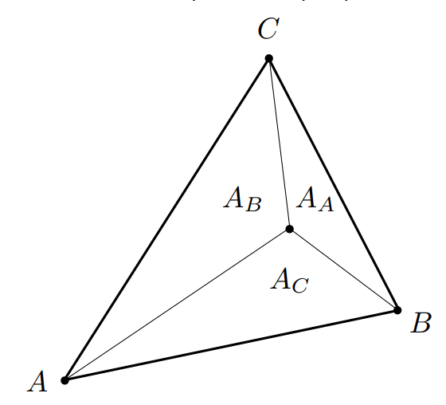

$$
\alpha = \frac{A_A}{A_A + A_B + A_C}
$$

$$
\beta = \frac{A_B}{A_A + A_B + A_C}
$$

$$
\gamma = \frac{A_C}{A_A + A_B + A_C} = 1 - \alpha - \beta
$$

当$\alpha=\beta=\gamma = \frac{1}{3}$时，$A_A = A_B = A_C$，该点也是这个三角形的**重心**

### 重心坐标的应用

在光栅化后对屏幕上每个像素进行着色时（即Fragment Shading），我们已知一个三角形三个顶点的各种属性数据（纹理坐标，颜色，法线向量，深度z，各种material attributes等），使用重心坐标插值处每个像素对应的各种顶点属性数据。

$$
V = \alpha V_A + \beta V_B + \gamma V_C
$$

 
重心坐标在投影变换后不一致!

即空间中一个三角形ABC和三角形内部一个点P，投影到平面对应点为A'B'C'和内部点P'，P的$\alpha \beta \gamma$和P'不相同！

因此在插值深度z时需要进行深度修正

TODO: 深度修正公式

## Applying Textures 应用纹理

~~~c++
// (x, y) usually a pixel's center
for each rasterized screen sample (x,y):
	// using barycentric coordinates
	(u, v) = evaluate texture coordinate at (x,y)
	texcolor = texture.sample(u, v);
	// usually the diffuse albedo Kd (recall the Blinn-Phong reflectance model)
	set sample color to texcolor;
~~~

所以`texture.sample(u, v)`具体如何实现呢？
最简单的方式：找到uv对应离的最近的texel直接返回像素值
~~~c++
color texture::sample(float u, float v)
{
	int x = std::round(u * texture_width); // 四舍五入
	int y = std::round(v * texture_height);
	return texture_image[x, y];
}
~~~
但是当纹理分辨率过大或者过小；又或者物体离相机很近或者很小，导致一个像素相比一个纹理像素很小或很大（本质上就是像素和纹理像素的大小对应不平衡）的时候，会出现问题。

## Texture Magnification

### Texture is too Small

当一个低分辨率的纹理图像需要拉伸到高分辨率的像素上时，在查询纹理有以下几种策略：
- Nearest
	- 选择uv最近的一个像素中心并返回（即对uv进行四舍五入）
	- 缺点：有锯齿状，不平滑
- Bilinear
	- 选择离uv最近的四个像素中心进行双线性插值

- Bicubic
	- 选择离uv最近的16个像素进行三线性插值

### Texture is too Large

严重走样问题： 远处摩尔纹Moire，近处锯齿Jaggies

>图中底层灰色框表示一个个的纹理像素texel，灰点表示纹理像素的中心
>上层斜着的黑色框表示屏幕像素，蓝点表示屏幕像素的中心

问题原因：屏幕上的像素覆盖纹理的大小是各不相同的

- 近处一个像素覆盖较**少**的纹理
	- 因此使用该像素对应插值得到的uv查询对应的纹理值，近似为像素值
	- 没有问题

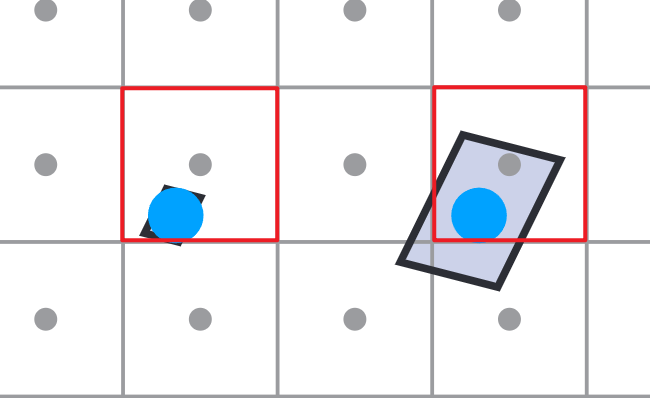

- 远处一个像素覆盖较**大**的纹理
	- 只用离uv最近的纹理像素代表覆盖的所有像素的平均值，显然是有问题的！

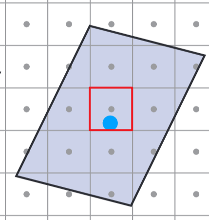

问题本质：信号速度变化过快，采样频率更不上

一个像素内包含了很多纹理像素，一个像素内的纹理变化频率很高，却只用一个采样点去采样导致了走样

#### Solution1: MSAA

对于一个像素不止取像素中心的uv，比如可以在一个像素范围内随机取512个uv，然后所有uv分别进行sample最后取平均

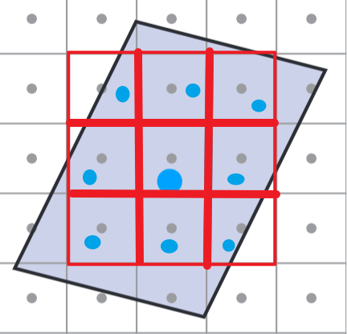

优点：准确！比以下各种方法都要准确（力大砖飞）

缺点：算法特别慢

#### Solution2: MipMap

如果给定任何一个区域，可以快速得到区域的平均值就好了

>**Point Query vs. (Avg.) Range Query**

>1. 点查询，比如给你一个点他的值是多少（如双线性插值）
>2. 范围查询，给你一个区域，立刻得到区域的平均值（还比如区域的最大值最小值）

**MipMap**：允许做范围查询
- Fast
- Approx（近似值）
- Square（只能查正方形）

MipMap就是使用一张图生成一系列图

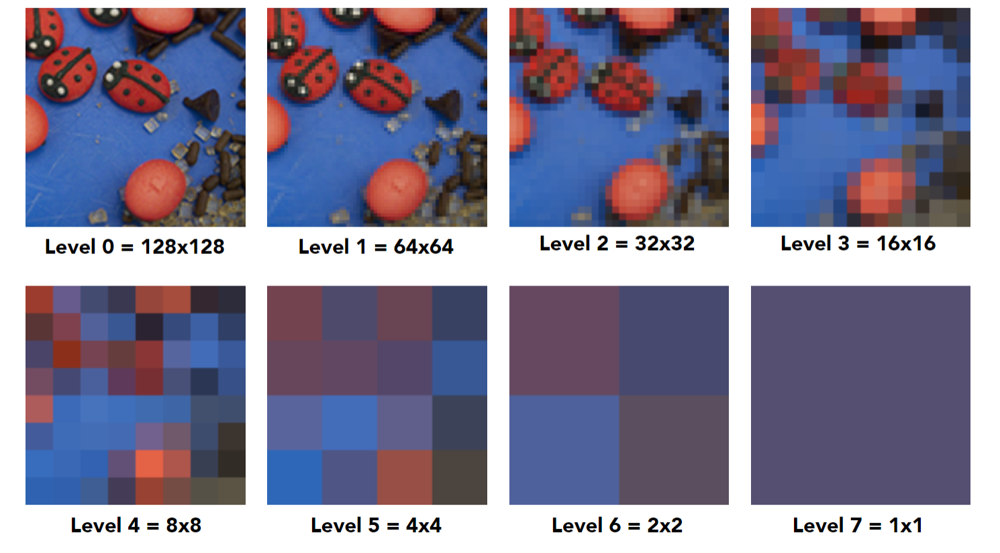

假设原始纹理宽为$n$，总共会有$log_2n$层
MipMap一般就是提前计算（渲染之前）
因此会得到一个图像金字塔

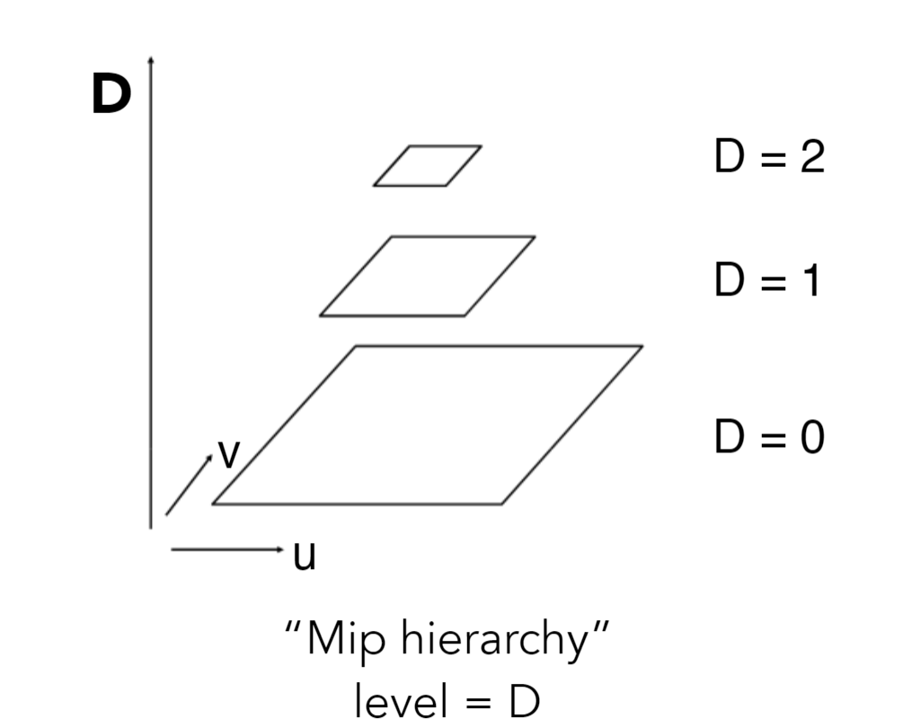

>**MipMap产生导致的额外存储量？**
>原本图是$1$，总量是$\frac{4}{3}$，增加了$\frac{1}{3}$

**MipMap的计算查询过程**

- 第一步：计算一个像素对应的纹理区域（区域中心和正方形大小）
	1. 对于一个屏幕像素(x, y)，通过重心坐标插值计算得到对应的纹理坐标(u, v)，记为$(u, v)_{00}$
	2. 同理计算该像素的邻居对应的uv，比如(x, y-1)，(x+1, y)，分别记为$(u, v)_{01}$和$(u, v)_{10}$
		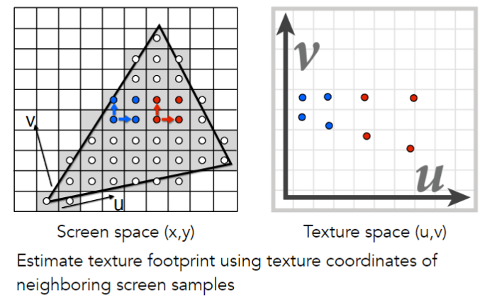
	3. 计算$(u, v)_{00} \to (u, v)_{01}$的长度和$(u, v)_{00} \to (u, v)_{10}$的长度并取最大值$L$
	4. 使用$L$来近似该像素对应纹理区域的正方形大小，而$(u, v)_{00}$就是区域的正中心
		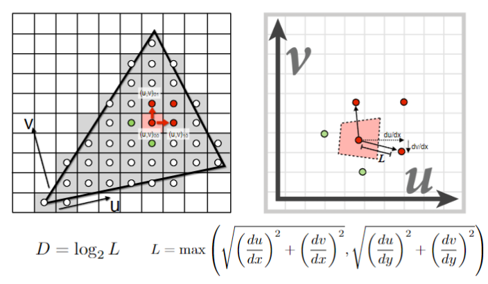
> 计算区域的方法还可以：求出一个像素的四个顶点处对应的uv，就能框出一个纹理区域

- 第二步：查询MipMap
	1. 计算$D = log_2L$获得层数
	2. 根据uv（也就是$(u, v)_{00}$）查询第$D$层MipMap的纹理图（这里就可以用到前面提到的双线性插值[[#Texture is too Small]]）
		- 到此可视化出来的MipMap就是阶跃的
		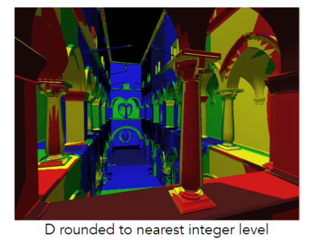
	3. 使MipMap层之间平滑过渡：对$D$向上取整$\lceil D \rceil$和向下取整$\lfloor D \rfloor$，对这两层分别按照2进行双线性插值
	4. 再对3得到的两个结果进行线性插值（整个过程就是三线性插值Trilinear Interpolation）

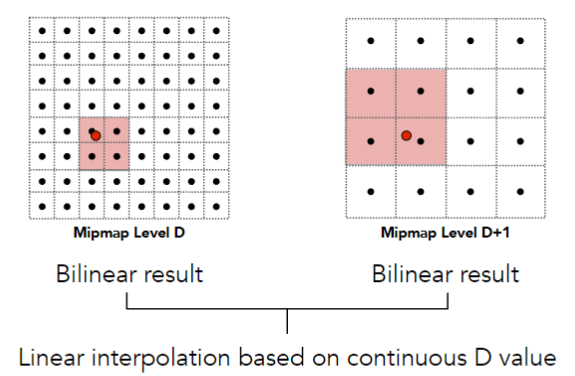

有了三线性插值，可视化MipMap也更平滑

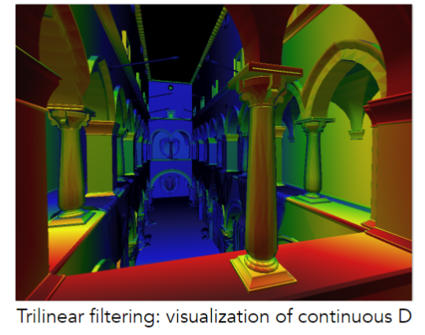

**MipMap存在的问题**：对于不规则的纹理区域，使用一个矩形框去圈，会出现overblur（模糊过度）的情况

下图远处的就直接模糊掉了，看不清线了

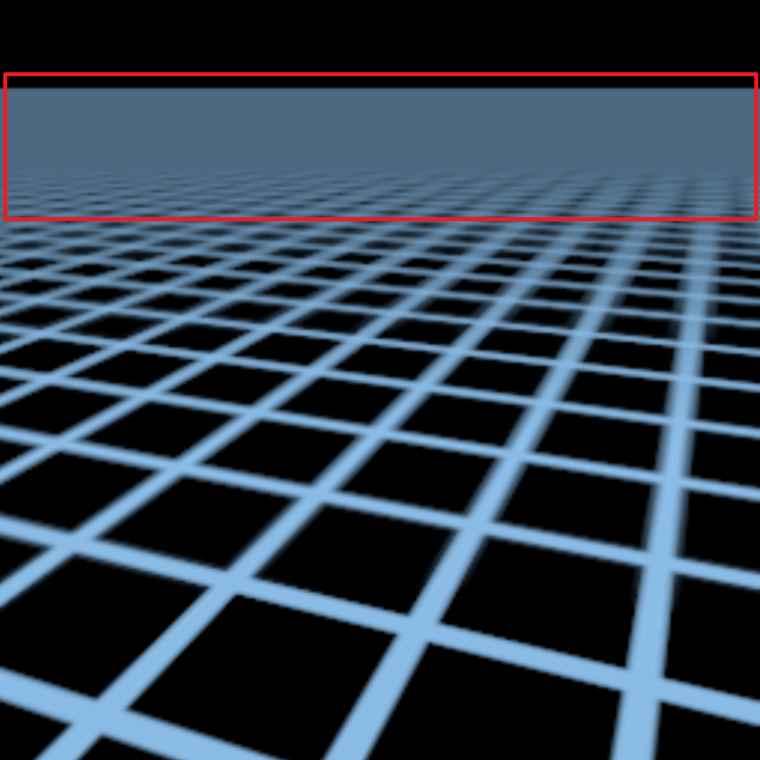

#### Solution3: Anisotropic Filtering

- 各向异性（各向异性是指，在不同方向上表现不同；如果相同就叫各向同性，MipMap就是各向同性）过滤，水平竖直方向进行压缩
- 也叫做RipMap

>原图开销为$1$，总共的开销是$3$

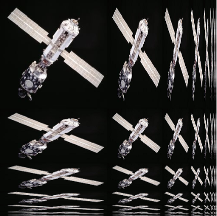

各向异性在游戏选项中会问你开启多少x，如果是2x就表示得到如下RipMap：

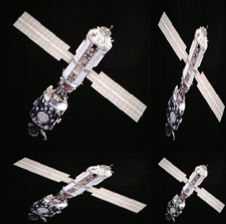

4x就得到如下RipMap：

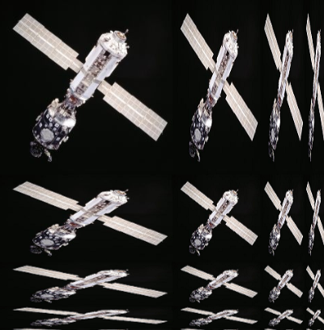

但总体而言会收敛为原图的三倍，因此多少x存储量不会有太多差距，一般显存足够直接开到最大

各向异性过滤支持矩形的范围查询（相比MipMap只能做正方形的范围查询），因此效果要比MipMap好。
如下图各向异性过滤圈出的框为绿色框，蓝色框为MipMap圈出的，可以发现绿色框更接近真实灰色区域。

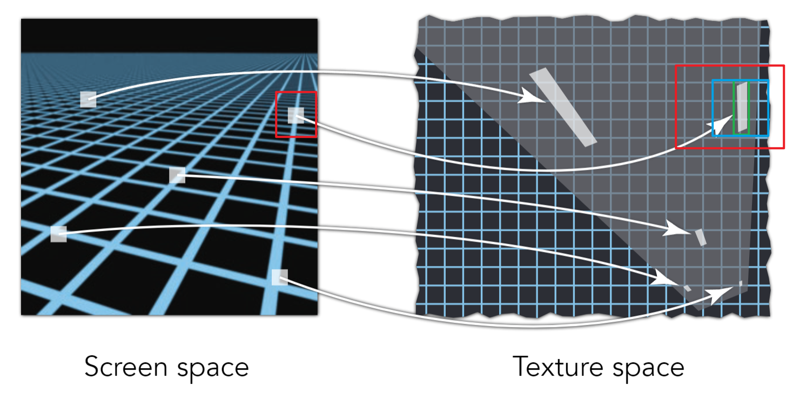

但是对于斜着的或者奇怪的区域，也会出现MipMap的overblur的情况

下面绿色框就表示使用各向异性过滤使一个像素对于一个矩形框的纹理像素，可以发现对绿色框取平均就会出现overblur，因为真实的情况是对绿色框中的灰色框取平均

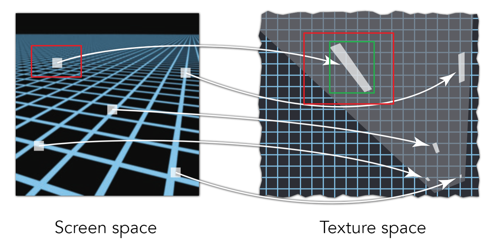

#### Solution4: EWA Filtering

任意不规则的区域，都可以拆成很多不同的圆形去覆盖
需要多次查询，比较耗时

## Applications of Textures

在现代GPU中，texture = memory + range query (filtering)，可以理解为有一块区域我可以做查询（或者滤波），包括点查询和范围查询。不仅仅是图像！

### Environment Lighting

Environment Map（环境光照，环境光映射，环境贴图）：一个房间里，四面八方都会有光（不管是直接光照还是间接光照），如果我们把任何方向的光都记录下来，这就是环境贴图

用纹理描述整个环境光，用环境光去渲染其他的物体

（效果肯定比点光源好）

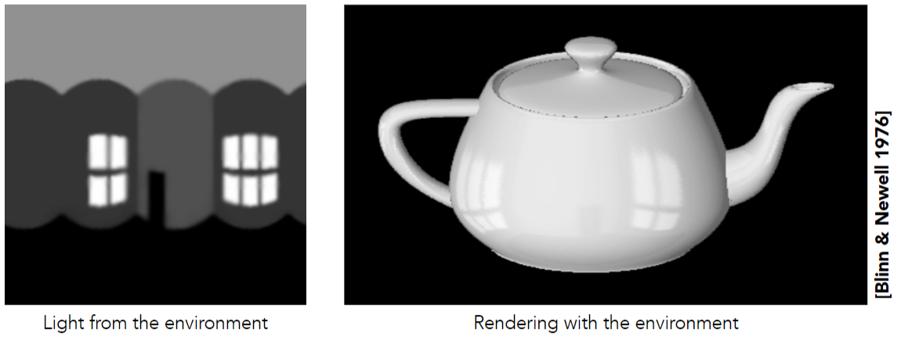

>这个著名的茶壶为Utah teapot，其他还有Stanford Bunny，Stanford Dragon，Cornell Box（验证全局光照）

用纹理描述环境光，有一个假设是环境光都来自**无限远出**，因此只记录了光的**方向信息**（没有位置信息）。
#### Spherical Environment Map

把环境光记录在球上，并且可以展开

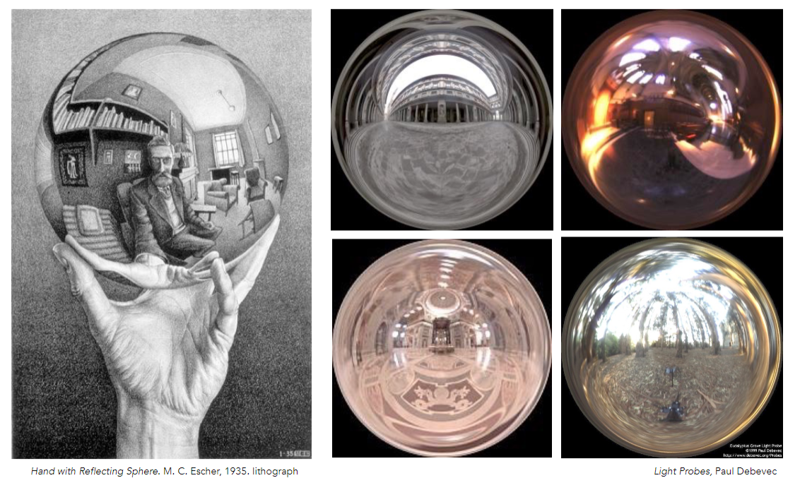

展开后：

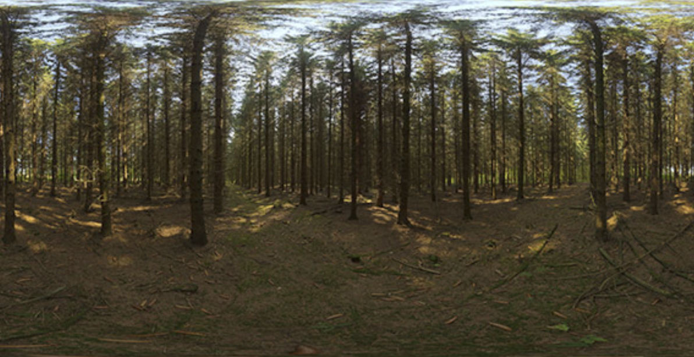

存在的问题：展开后的图形顶部和底部会向中间**扭曲**，不是一个均匀的描述

球到立方体的转换：

#### Cube Map

把环境光记录在立方体上，解决了扭曲问题
缺点：计算光照方向时需要先判断在哪个面（立方体六个面）上

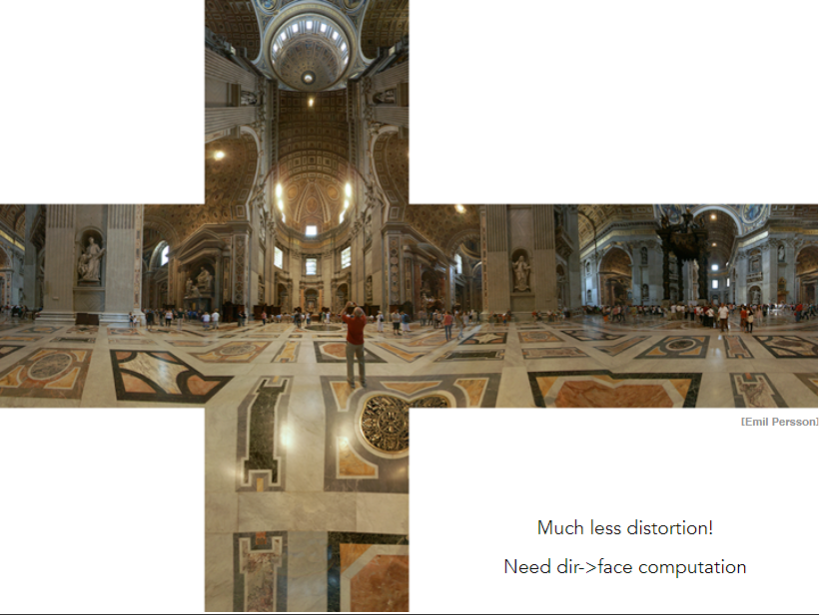

### Bump Mapping

Fake

凹凸贴图和法线贴图并没有改变几何，作用是一样的（渲染效果）取决于纹理定义的是相对高度偏移还是法线。本质上就是为了改变法线方向

具体实现：对任何一个顶点的法线进行一个扰动

凹凸贴图通过使顶点高度（相对于原来的法线方向）进行偏移，偏移后重新计算新的法线方向。
c是影响因子：人为定义

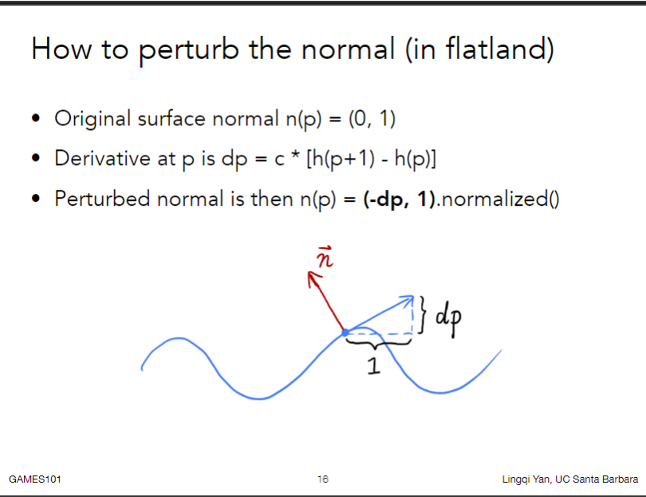

### Displacement Mapping

Really

凹凸贴图和位移贴图所用的纹理是一摸一样的，都是定义高度偏移
但是位移贴图会真的对顶点的位置进行偏移。

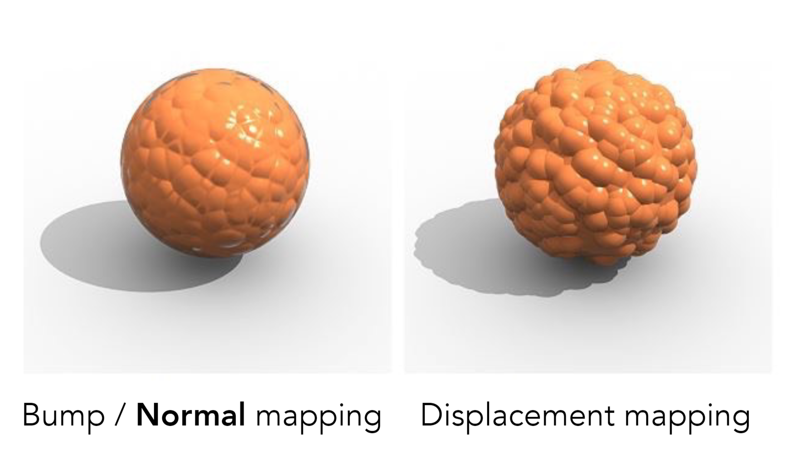
因此凹凸贴图在轮廓，以及阴影轮廓中还是原本的几何

位移贴图的限制：模型顶点数足够多，能够跟得上纹理变化速度（顶点之间的间隔比纹理变化频率高）
>DirectX提供了动态曲面细分，不需要高精度模型，会自动根据需要对模型局部进行曲面细分

### Provide Precomputed Shading
提供预计算

阴影实时计算：Ambient Occlusion（环境光遮蔽）
也可以预计算：Shadow Map？

### 3D Procedural Noise + Solid Modeling

Perlin噪声用于生成山脉

### 3D Textures & Volume Rendering

体渲染

